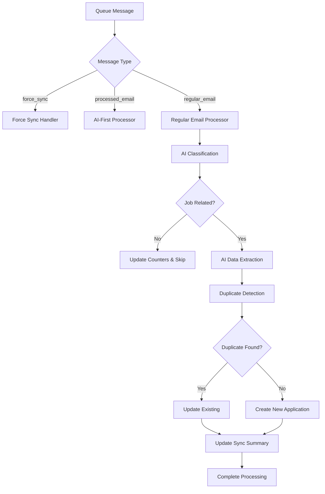

# Queue Consumer Module

This module provides a well-structured, modular architecture for processing email queue messages in the TrackFlow application. It replaces the monolithic `queue-consumer.ts` file with focused, testable components.

## Architecture Overview

```
lib/queue-consumer/
├── index.ts                    # Main exports
├── types.ts                    # All type definitions and constants
├── ai-utils.ts                 # AI processing utilities and rate limiting
├── content-utils.ts            # HTML/content processing utilities
├── database.ts                 # Database operations
├── duplicate-handler.ts        # Application duplicate detection
├── application-processor.ts    # Email to application conversion
├── force-sync-handler.ts       # Force sync request handling
├── batch-processor.ts          # Main batch processing logic
└── README.md                   # This documentation
```

## Module Responsibilities

### 🏗️ **types.ts**

- **Purpose**: Centralized type definitions and constants
- **Contents**:
  - Environment interfaces (`QueueConsumerEnv`)
  - Zod schemas for validation
  - Application data types
  - Rate limiting constants
  - Status priority mappings

### 🧠 **ai-utils.ts**

- **Purpose**: AI processing utilities and application logic
- **Key Functions**:
  - `rateLimitedAICall()` - Enforces AI rate limiting
  - `shouldUpdateApplicationStatus()` - Status priority management
  - `createComprehensiveAIReasoning()` - Multi-email reasoning generation
  - `updateAIReasoningForExistingApplication()` - Update existing applications

### 🧹 **content-utils.ts**

- **Purpose**: Content processing and cleaning utilities
- **Key Functions**:
  - `cleanHtmlContent()` - HTML cleaning and text extraction
  - Handles quoted-printable encoding
  - Removes marketing content and preserves meaningful text

### 💾 **database.ts**

- **Purpose**: All database operations and queries
- **Key Functions**:
  - `saveFailedEmail()` - Error tracking and failed email storage
  - `updateEmailAnalyzedCount()` / `updateSyncSummary()` - Progress tracking
  - `addEmailSourceToApplication()` - Link emails to applications
  - `getExistingApplications()` - Fetch user applications for deduplication
  - `checkAndCompleteStuckSyncs()` - Sync completion management

### 🔍 **duplicate-handler.ts**

- **Purpose**: Application duplicate detection and handling
- **Key Functions**:
  - `checkAndHandleDuplicates()` - AI-powered duplicate detection
  - `handleAIFirstDuplicates()` - AI-first email duplicate handling
  - Integrates with AI deduplicator for intelligent matching

### 📧 **application-processor.ts**

- **Purpose**: Convert emails to job applications
- **Key Functions**:
  - `createNewApplication()` - Create new job applications
  - `upsertApplication()` - Update or insert with conflict resolution
  - `processRegularEmail()` - Full email processing pipeline
  - `processAIFirstEmail()` - Handle pre-processed AI emails
  - `handleConstraintViolation()` - Graceful constraint error handling

### 🔄 **force-sync-handler.ts**

- **Purpose**: Handle force sync requests
- **Key Functions**:
  - `handleForceSyncMessage()` - Process force sync queue messages
  - Token repository initialization
  - Rate limiting enforcement
  - Integration with email fetcher sync engine

### ⚡ **batch-processor.ts**

- **Purpose**: Main orchestration and batch processing
- **Key Functions**:
  - `handleEmailParseQueueBatch()` - Main entry point
  - Message sorting and prioritization
  - Database connection management
  - Error handling and retry logic
  - Sync completion monitoring

## Usage Examples

### Basic Usage (Main Entry Point)

```typescript
import { handleEmailParseQueueBatch } from './lib/queue-consumer';

// In your queue consumer handler
export default {
	async queue(batch: MessageBatch<QueueMessage>, env: QueueConsumerEnv, ctx: ExecutionContext): Promise<void> {
		return await handleEmailParseQueueBatch(batch, env, ctx);
	},
};
```

### Using Individual Modules

```typescript
import { rateLimitedAICall, saveFailedEmail, createNewApplication, cleanHtmlContent } from './lib/queue-consumer';

// AI rate limiting
const result = await rateLimitedAICall(() => classifyEmail(email, aiBinding));

// Database operations
await saveFailedEmail(db, emailToParse, 'Classification failed', 3);

// Application creation
const app = await createNewApplication(db, emailData);

// Content processing
const cleanText = cleanHtmlContent(htmlContent);
```

## Message Flow



## Error Handling

The module implements comprehensive error handling:

1. **Retry Logic**: Messages retry up to 3 times with exponential backoff
2. **Failed Email Tracking**: Failed emails are stored in `failed_email_reviews` table
3. **Graceful Degradation**: Constraint violations are handled by finding existing applications
4. **Progress Tracking**: Sync summaries track processing progress and completion

## Configuration

### Environment Variables

- `AI`: AI binding for classification and extraction
- `HYPERDRIVE_SUPABASE`: Database connection
- `TOKEN_ENCRYPTION_KEY`: For accessing Gmail tokens
- `EMAIL_PARSE_QUEUE`: Queue for email processing
- `EMAIL_SYNC_RATE_KV`: Rate limiting storage

### Constants (Configurable in types.ts)

- `AI_RATE_LIMIT_PER_MINUTE`: 250 (AI calls per minute)
- `MAX_RETRIES`: 3 (Maximum retry attempts)
- `STATUS_PRIORITY`: Application status progression rules

## Testing

Each module can be unit tested independently:

```typescript
// Example test for ai-utils
import { shouldUpdateApplicationStatus } from './ai-utils';

test('should allow status updates to higher priority', () => {
	expect(shouldUpdateApplicationStatus('Applied', 'Interviewing')).toBe(true);
	expect(shouldUpdateApplicationStatus('Interviewing', 'Applied')).toBe(false);
});
```

## Migration Notes

### From Original queue-consumer.ts

The refactored modules maintain **100% functional compatibility** with the original implementation:

- All queue message types are supported
- Database schema interactions remain unchanged
- AI processing logic is preserved
- Error handling behavior is maintained
- Performance characteristics are improved through modularization

### Breaking Changes

**None** - This is a pure refactoring with no breaking changes to the public API.

## Performance Benefits

1. **Reduced Memory Usage**: Smaller, focused modules
2. **Better Caching**: Individual module imports reduce bundle size
3. **Improved Testability**: Each function can be tested in isolation
4. **Enhanced Maintainability**: Clear separation of concerns
5. **Parallel Processing**: Independent modules can be optimized separately

## Future Enhancements

The modular structure enables easy extension:

- **Custom AI Models**: Replace AI utilities without affecting other modules
- **Alternative Databases**: Swap database module for different storage backends
- **Enhanced Deduplication**: Upgrade duplicate detection without touching core logic
- **Monitoring Integration**: Add observability to individual modules
- **Performance Optimizations**: Optimize specific bottlenecks independently
